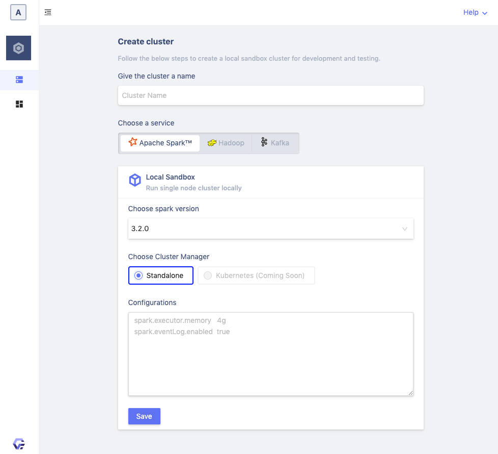

[](https://gigahex.com)

[](https://twitter.com/ToolJet)
## Gigahex Data Infrastructure Platform

Gigahex is a web based data infrastructure platform to deploy and manage Apache Spark™, Apache 
Kafka and Apache Hadoop clusters. Currently it supports running a single node cluster for 
local development and testing.

Actively developed by [Gigahex LLP](https://gigahex.com).

[](https://gigahex.com)

## Main Features
- Visually build and deploy Spark, Kafka and HDFS Clusters
- View Spark applications and easily navigate to the Spark History Web UI
- View Kafka topics and messages
- Browse directories and files in HDFS

## Quick Start

### Install on MacOS

You can run Gigahex Data Platform on MacOS, using the following instructions.

- Install the dependencies - postgresql and Java 11 for the server.

    ```bash
    brew install postgresql java11
    ```

    - Install the Gigahex platform

    ```bash
    curl -s https://packages.gigahex.com/mac.sh | bash
    ```

- View the usage

    ```bash
    $  gxc help
    Gigahex CLI

    gxc [options]
    Option   Description
    ------------------------------------
    help     Show usage
    start    Start the gigahex service
    stop     Stop the gigahex service
    reset    Reset the gigahex service
    ```

### Install on Windows

You can install Gigahex on Windows after enabling
[WSL2](https://docs.microsoft.com/en-us/windows/wsl/about). Follow the below
instructions to setup WSL2 and Ubuntu distro and install Gigahex.

- Install WSL 2 with the below command. After installation, you would need to reboot your system to
  continue with the installation.
  ```bash
    wsl --install -d Ubuntu
  ```

- On reboot, login to Ubuntu shell, setup your password and run the below
  command to install the dependencies - postgresql and Java Runtime 11

    ```bash
    sudo apt-get install postgresql postgresql-contrib default-jre
    ```

- Now with the dependencies installed, set up Gigahex Data platform

    ```bash
    curl -s https://packages.gigahex.com/nix.sh | bash
    ```

    Once you've installed the platform, reopen the shell and run the following
    command to start the platform.

- View the usage

    ```bash
    $  gxc help
    Gigahex CLI

    gxc [options]
    Option   Description
    ------------------------------------
    help     Show usage
    start    Start the gigahex service
    stop     Stop the gigahex service
    reset    Reset the gigahex service
    ```
### Install on Ubuntu

You can install Gigahex on Ubuntu as per the instructions below.

- Run the below command to install the dependencies - postgresql and Java
  Runtime 11

    ```bash
    sudo apt-get install postgresql postgresql-contrib default-jre
    ```

- Now with the dependencies installed, set up Gigahex Data platform

    ```bash
    curl -s https://packages.gigahex.com/nix.sh | bash
    ```

Once you've installed the platform, reopen the shell and run the following
command to start the platform.

- View the usage

    ```bash
    $  gxc help
    Gigahex CLI

    gxc [options]
    Option   Description
    ------------------------------------
    help     Show usage
    start    Start the gigahex service
    stop     Stop the gigahex service
    reset    Reset the gigahex service
    ```

### Start the Gigahex

Once you've the setup ready, run the following command to start the services,
and use the admin credentials generated to login to the platform.

```bash
$ gxc start

 ██████  ██  ██████   █████  ██   ██ ███████ ██   ██
██       ██ ██       ██   ██ ██   ██ ██       ██ ██
██   ███ ██ ██   ███ ███████ ███████ █████     ███
██    ██ ██ ██    ██ ██   ██ ██   ██ ██       ██ ██
 ██████  ██  ██████  ██   ██ ██   ██ ███████ ██   ██

 Open Source Data Infrastructure Platform.

> Starting the Gigahex Data Platform
> Welcome to Gigahex! 👋
> username: admin, password: **********
> Visit http://localhost:9080 to get started!
```
